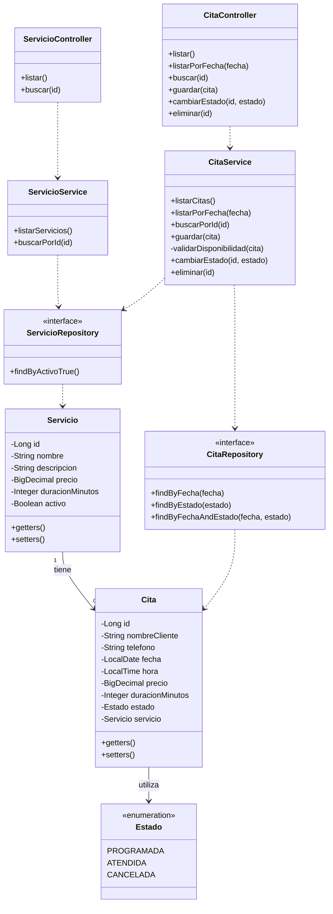

```mermaid
classDiagram

class Servicio {
    -Long id
    -String nombre
    -String descripcion
    -BigDecimal precio
    -Integer duracionMinutos
    -Boolean activo
    +getters()
    +setters()
}

class Cita {
    -Long id
    -String nombreCliente
    -String telefono
    -LocalDate fecha
    -LocalTime hora
    -BigDecimal precio
    -Integer duracionMinutos
    -Estado estado
    -Servicio servicio
    +getters()
    +setters()
}

class Estado {
    <<enumeration>>
    PROGRAMADA
    ATENDIDA
    CANCELADA
}

class ServicioRepository {
    <<interface>>
    +findByActivoTrue()
}

class CitaRepository {
    <<interface>>
    +findByFecha(fecha)
    +findByEstado(estado)
    +findByFechaAndEstado(fecha, estado)
}

class ServicioService {
    +listarServicios()
    +buscarPorId(id)
}

class CitaService {
    +listarCitas()
    +listarPorFecha(fecha)
    +buscarPorId(id)
    +guardar(cita)
    -validarDisponibilidad(cita)
    +cambiarEstado(id, estado)
    +eliminar(id)
}

class ServicioController {
    +listar()
    +buscar(id)
}

class CitaController {
    +listar()
    +listarPorFecha(fecha)
    +buscar(id)
    +guardar(cita)
    +cambiarEstado(id, estado)
    +eliminar(id)
}

Servicio "1" --> "0..*" Cita : tiene
Cita --> Estado : utiliza

ServicioRepository ..> Servicio
CitaRepository ..> Cita

ServicioService ..> ServicioRepository
CitaService ..> CitaRepository
CitaService ..> ServicioRepository

ServicioController ..> ServicioService
CitaController ..> CitaService
```
